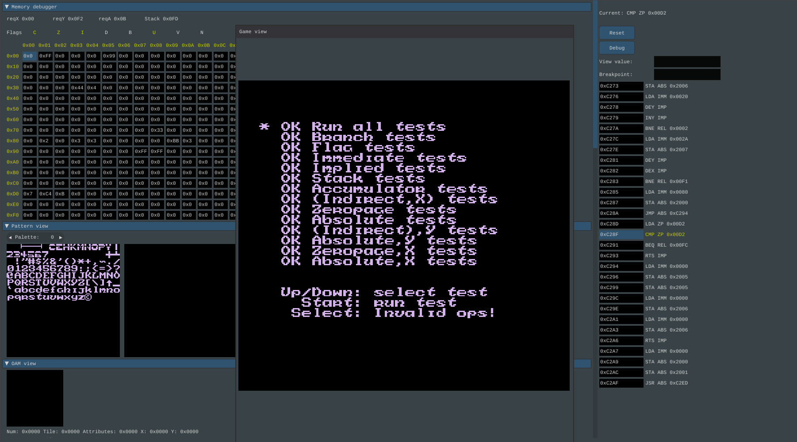
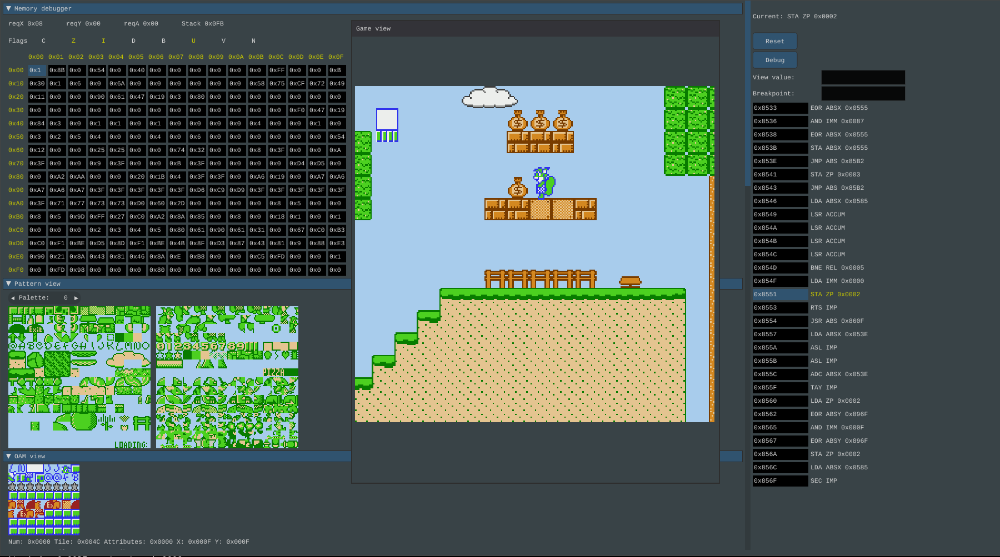

# nes-emu
This is implementation of nes emulator which aims to visualize the NES platform.
This is done mainly as educational project. I have have used existing documentation of 6502 processor and other NES components to implement this.
Other emulators has also been used as an inspiration.

Project uses OpenGL rendering and [Nulkear](https://github.com/Immediate-Mode-UI/Nuklear) library for GUI.
Some basic memory mappers are implemented and more might be coming. Emulator is in basic working stage, not all features are impleneted.
Currently is build as an unity build and only has linux build. Windows could be done following the build.sh logic

# Images

Nest test rom.

Gameplay visualisation for [Nova The Squirrel](https://github.com/NovaSquirrel/NovaTheSquirrel)

